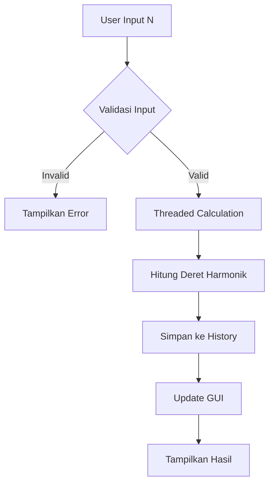

# 🧮 Deret Harmonik

<div align="center">


**Aplikasi perhitungan deret harmonik dengan GUI modern dan sistem penyimpanan riwayat**

[Fitur](#-fitur) • [Instalasi](#-instalasi) • [Penggunaan](#-penggunaan) • [Dokumentasi](#-dokumentasi) 

</div>

## 📋 Daftar Isi

- [Gambaran Umum](#-gambaran-umum)
- [Fitur](#-fitur)
- [Instalasi](#-instalasi)
- [Penggunaan](#-penggunaan)
- [Dokumentasi](#-dokumentasi)
- [Contoh Penggunaan](#-contoh-penggunaan)
- [FAQ](#-faq)
- [Matematika Dasar](#-matematika-dasar)

## 🚀 Gambaran Umum

**Deret Harmonik** adalah aplikasi Python yang dirancang untuk menghitung dan memvisualisasikan deret harmonik dengan antarmuka grafis yang modern dan user-friendly. Deret harmonik adalah deret matematika yang sangat penting dalam berbagai bidang seperti matematika, fisika, dan ilmu komputer.

### ✨ Highlights

- 🎨 **GUI Modern** dengan tema light yang profesional
- 💾 **Sistem Riwayat** penyimpanan otomatis perhitungan
- 🧮 **Perhitungan Presisi Tinggi** hingga 12 digit desimal
- 📊 **Visualisasi Riwayat** dengan tabel interaktif
- 🚀 **Multi-threading** untuk perhitungan besar
- 📁 **Export Data** ke format JSON
- ⚡ **Responsif** dengan validasi input real-time

## 🌟 Fitur

### 🧮 Core Features
- **Perhitungan Deret Harmonik** - Menghitung 1 + 1/2 + 1/3 + ... + 1/n
- **Presisi Tinggi** - Hasil hingga 12 digit desimal
- **Penjabaran Lengkap** - Menampilkan bentuk penjabaran deret
- **Validasi Input** - Pemeriksaan input secara real-time

### 💾 Data Management
- **Auto-save History** - Setiap perhitungan langsung tersimpan
- **JSON Storage** - Format penyimpanan terstruktur
- **Riwayat Terbatas** - Otomatis membatasi 50 entri terakhir
- **Backup Otomatis** - Data aman dan tersimpan dengan baik

### 🎨 GUI Features
- **Modern Interface** - Tampilan clean dan profesional
- **Real-time Updates** - Update tampilan secara real-time
- **Interactive Table** - Tabel riwayat yang dapat di-click
- **Responsive Design** - Adaptif berbagai ukuran layar
- **Keyboard Shortcuts** - Navigasi cepat dengan keyboard

### ⚡ Performance Features
- **Multi-threading** - Perhitungan besar tidak freeze GUI
- **Optimized Calculation** - Algoritma perhitungan yang efisien
- **Memory Management** - Manajemen memori yang optimal
- **Error Handling** - Penanganan error yang komprehensif

### Fitur Interaktif

- **Double-click Riwayat** - Klik ganda pada riwayat untuk mengisi ulang input
- **Real-time Validation** - Validasi input saat mengetik
- **Auto-refresh** - Riwayat terupdate otomatis setelah perhitungan

## 📥 Instalasi

### Prerequisites

- Python 3.7 atau lebih tinggi
- Tidak memerlukan library external (pure Python)

### Step-by-Step Installation

1. **Download Project**
   ```bash
   # Jika menggunakan git
   git clone https://github.com/username/program-deret-harmonik.git
   cd program-deret-harmonik
   
   # Atau download langsung file ZIP
   ```

2. **Buat Virtual Environment (Recommended)**
   ```bash
   python -m venv harmonik_env
   
   # Windows
   harmonik_env\Scripts\activate
   
   # Linux/Mac
   source harmonik_env/bin/activate
   ```

3. **Verifikasi Instalasi**
   ```bash
   python main.py
   ```

### Quick Install (Windows)
```bash
# Langsung jalankan tanpa instalasi
python main.py
```

## 🎮 Penggunaan

### Menjalankan Aplikasi

```bash
python main.py
```

### Basic Usage

1. **Input Bilangan**
   - Masukkan bilangan bulat positif N di field input
   - Tekan `Enter` atau klik tombol "Hitung Deret"

2. **Melihat Hasil**
   - Hasil perhitungan muncul di area "Hasil Perhitungan"
   - Penjabaran deret ditampilkan dalam format matematika

3. **Mengelola Riwayat**
   - Riwayat otomatis tersimpan di tabel
   - Klik ganda pada riwayat untuk mengisi ulang input
   - Gunakan tombol "Refresh" untuk update terbaru

### Keyboard Shortcuts

| Shortcut | Action |
|----------|--------|
| `Enter` | Jalankan perhitungan |
| `Ctrl + R` | Refresh riwayat |
| `Ctrl + C` | Clear input |
| `Esc` | Focus ke input field |

### Contoh Input/Output

```
Input: 5
Output: 1 + (1/2) + (1/3) + (1/4) + (1/5) = 2.283333333333
```

## 📚 Dokumentasi

### Workflow Diagram


---

### File Descriptions

| File | Description |
|------|-------------|
| `main.py` | Entry point aplikasi, handle argument |
| `gui_app.py` | Implementasi GUI dengan Tkinter |
| `deret_harmonik.py` | Logic perhitungan dan validasi |
| `history_manager.py` | Manajemen penyimpanan riwayat |
| `config.py` | Konfigurasi warna, path, dan settings |

## 💡 Contoh Penggunaan

### Basic Calculation
```
Input: 3
Output: 1 + (1/2) + (1/3) = 1.833333333333

Input: 10  
Output: 1 + (1/2) + (1/3) + ... + (1/10) = 2.928968253968
```

### Advanced Examples
```
N = 100    → Hasil: 5.187377517639
N = 1000   → Hasil: 7.485470860550
N = 10000  → Hasil: 9.787606036044
```

### Contoh Riwayat
```json
{
  "timestamp": "2024-01-15 14:30:22",
  "n": 5,
  "hasil": 2.283333333333,
  "penjabaran": "1 + (1/2) + (1/3) + (1/4) + (1/5)"
}
```

## ❓ FAQ

### Q: Apa itu deret harmonik?
**A:** Deret harmonik adalah deret tak hingga 1 + 1/2 + 1/3 + 1/4 + ... yang divergen namun sangat penting dalam matematika.

### Q: Berapa nilai N maksimal yang bisa dihitung?
**A:** Program bisa menghitung hingga N = 1,000,000. Untuk nilai lebih besar, mungkin perlu waktu lebih lama.

### Q: Apakah data riwayat tersimpan secara permanen?
**A:** Ya, data tersimpan di file JSON dan akan tetap ada meski aplikasi ditutup.

### Q: Bisakah menghitung deret harmonik untuk bilangan desimal?
**A:** Tidak, program hanya mendukung bilangan bulat positif untuk N.

### Q: Bagaimana cara reset semua riwayat?
**A:** Gunakan tombol "Hapus Riwayat" di aplikasi atau hapus file `history_deret_harmonik.json`.

## 📊 Matematika Dasar

### Definisi Deret Harmonik

Deret harmonik didefinisikan sebagai:
```
Hₙ = 1 + 1/2 + 1/3 + 1/4 + ... + 1/n
```

### Sifat-sifat Penting

- **Divergen**: Deret harmonik divergen ketika n → ∞
- **Pertumbuhan Logaritmik**: Hₙ ≈ ln(n) + γ (γ = konstanta Euler-Mascheroni ≈ 0.57721)
- **Aplikasi**: Banyak digunakan dalam analisis algoritma, fisika, dan teori bilangan

### Contoh Nilai

| n | Hₙ (approx) |
|---|-------------|
| 1 | 1.000000 |
| 5 | 2.283333 |
| 10 | 2.928968 |
| 100 | 5.187378 |
| 1000 | 7.485471 |

## 🔬 Aplikasi dalam Dunia Nyata

### Computer Science
- Analisis kompleksitas algoritma
- Hash table collisions
- Randomized algorithms

### Fisika
- Model rantai molekul
- Perhitungan energi potensial
- Gelombang dan resonansi

### Matematika
- Teori bilangan
- Analisis real
- Kalkulus

---

<div align="center">

**⭐ Jika project ini membantu, jangan lupa beri bintang! ⭐**

[Kembali ke Atas](#-deret-harmonik)

</div>